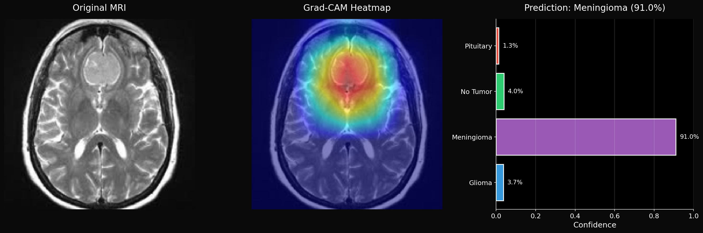
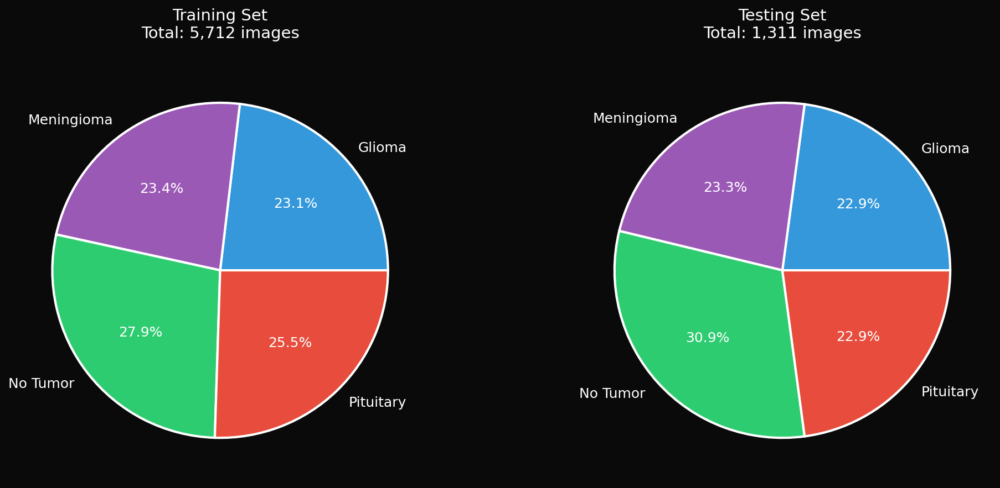
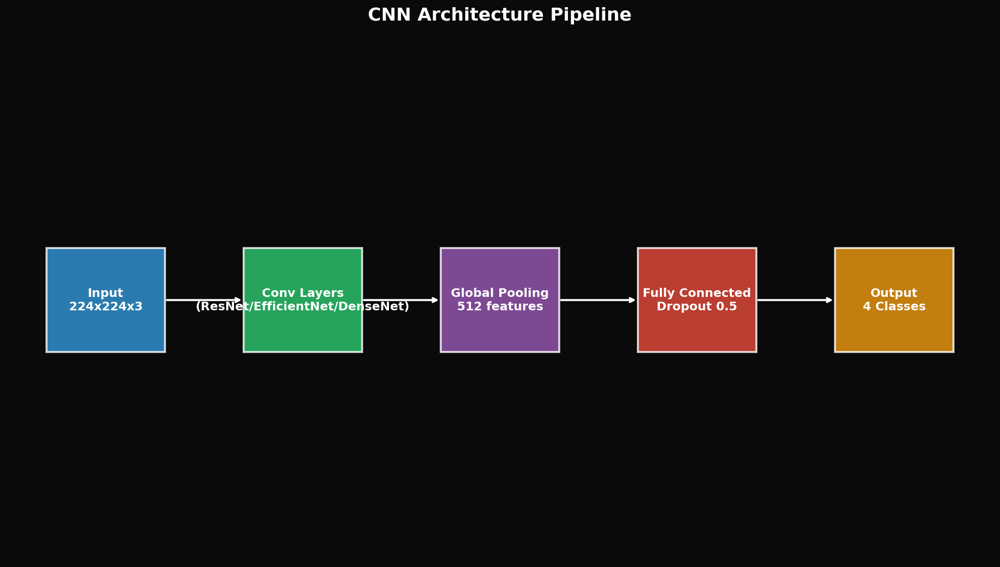
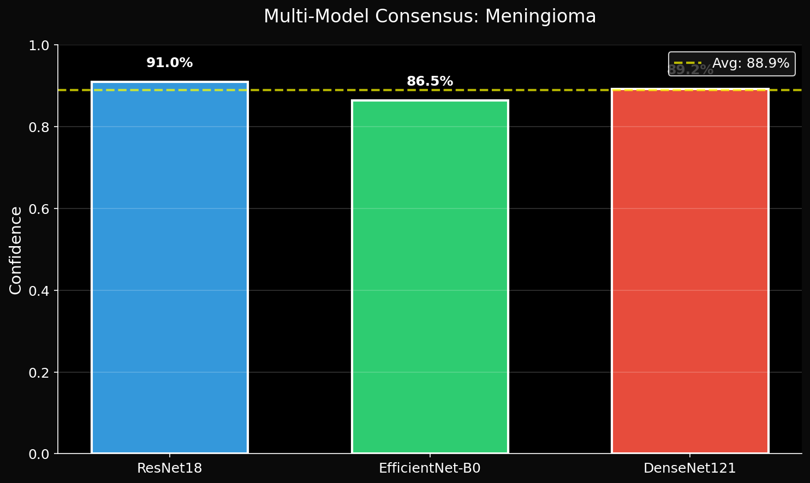
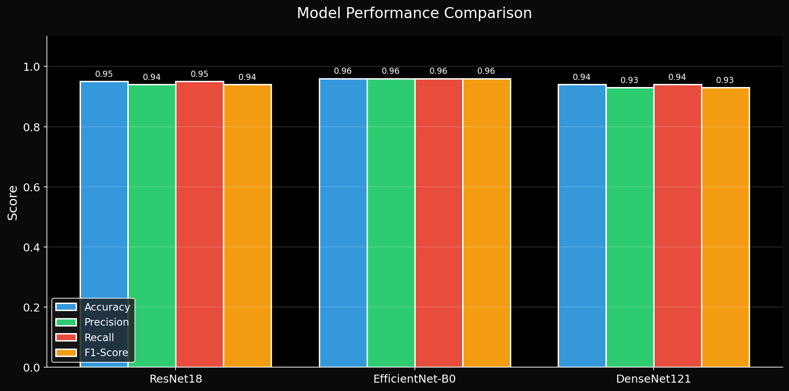

# Brain Tumor MRI Classifier

A deep learning system for classifying brain MRI scans into four categories: glioma, meningioma, pituitary tumor, or no tumor. The project includes PyTorch models with transfer learning, a Flask web application with explainable AI visualizations, and multi-model consensus inference.

## Overview

This project demonstrates an end-to-end machine learning pipeline for medical image classification, featuring:

- **Multi-model ensemble**: ResNet18, EfficientNet-B0, and DenseNet121 with majority-vote consensus
- **Explainable AI**: Grad-CAM heatmaps and bounding box detection for model interpretability
- **Web interface**: Modern browser-based UI with drag-and-drop uploads and real-time predictions
- **Cross-platform support**: Automatic device detection for Apple Silicon (MPS), CUDA, and CPU

## Features

- Multi-model inference with majority-vote consensus and confidence reporting
- Grad-CAM heatmaps and bounding boxes for each prediction
- Interactive web UI with drag-and-drop uploads, random test images, and probability visualizations
- User feedback collection for continuous model improvement
- Automatic hardware acceleration (MPS/CUDA/CPU)
- Training and evaluation scripts with comprehensive metrics

### Example Prediction

The system provides comprehensive predictions with class probabilities, Grad-CAM heatmaps, and bounding box visualizations to highlight regions of interest in the MRI scan.



## Repository Structure

```
.
├── docs/               # Guides (data paths, training, diagrams)
├── src/brain_tumor/    # Shared utilities (paths, transforms)
├── website/          # Flask application, templates, static assets
├── scripts/          # Training, evaluation, and data preparation utilities
├── notebooks/        # Jupyter notebooks for exploration and training
├── models/           # Saved model weights (excluded from git by default)
├── data/             # Dataset directory (excluded from git)
└── runs/             # Training metrics and logs
```

## Requirements

- Python 3.10+
- PyTorch 2.0+
- Flask 3.0+
- Conda or Mamba (recommended)

## Installation

### 1. Clone the repository

```bash
git clone https://github.com/vaemco/brain-tumor-classifier.git
cd brain-tumor-classifier
```

### 2. Create and activate the conda environment

```bash
conda env create -f environment.yml
conda activate data_brain
```

Note: Remove the `cpuonly` line in `environment.yml` if you want GPU support (CUDA).

### 3. Download the dataset

The dataset is not included in this repository. Download the following datasets from Kaggle:

- [Brain Tumor MRI Dataset](https://www.kaggle.com/datasets/masoudnickparvar/brain-tumor-mri-dataset)
- [Brain Tumor Dataset](https://www.kaggle.com/datasets/ishans24/brain-tumor-dataset)

Extract and organize the data as follows:

```
data/Brain_Tumor_Dataset/
  Training/
    glioma/
    meningioma/
    notumor/
    pituitary/
  Testing/
    glioma/
    meningioma/
    notumor/
    pituitary/
  external_dataset/
    training/
      glioma/
      meningioma/
      notumor/
      pituitary/
    testing/
      glioma/
      meningioma/
      notumor/
      pituitary/
```

If your downloaded dataset is not pre-split, run the data preparation script:

```bash
python scripts/prepare_data.py
```

### Dataset Distribution

The combined dataset contains 7,203 training images and 1,311 testing images across four classes. The distribution is relatively balanced with slight variations between classes.



### 4. Model weights

**⚠️ Important:** Model weights are not included in the repository and must be trained yourself. The application automatically loads available model weights from the `models/` directory:

- `models/brain_tumor_resnet18_v2_trained.pt`
- `models/brain_tumor_efficientnet_b0_trained.pt`
- `models/brain_tumor_densenet121_trained.pt`

**Training the Models:** Please follow the detailed guide in `docs/guides/TRAINING_GUIDE.md` to train the models yourself. The application works with all available trained models.

**Future Updates:** Once the models are fully trained and validated, the final weights will be made available and documented in the repository.

## Usage

### Running the web application

```bash
python -m website.app
```

The application will start on `http://localhost:3000`. You can:

- Upload MRI images via drag-and-drop
- Use the random test feature to test on images from the test dataset
- View predictions with probability distributions
- Inspect Grad-CAM heatmaps and bounding boxes
- Submit feedback on predictions

### API endpoints

- `GET /api/health` - Health check and model status
- `POST /api/predict` - Upload image and get prediction
- `GET /api/random-test` - Get random test image with prediction
- `POST /api/feedback` - Submit user feedback

Example health check:

```bash
curl http://localhost:3000/api/health
```

## Training

**Detailed Training Guide:** Please read the complete guide in `docs/guides/TRAINING_GUIDE.md` for important notes, best practices, and what to pay attention to during training.

### Using Jupyter notebooks

The project includes training notebooks optimized for different scenarios:

- `notebooks/01_exploration.ipynb` - Exploratory data analysis
- `notebooks/02_train_resnet18.ipynb` - ResNet18 training with combined datasets
- `notebooks/03_train_efficientnet_b0.ipynb` - EfficientNet-B0 training
- `notebooks/04_train_densenet121.ipynb` - DenseNet121 training
- `notebooks/05_model_explainability_education.ipynb` - Grad-CAM and explainability

All notebooks use relative paths and automatically detect the project root. See `docs/guides/FIX_DATA_PATHS.md` for path configuration details.

**Note:** Trained models are saved with unique names:

- `brain_tumor_resnet18_v2_trained.pt`
- `brain_tumor_efficientnet_b0_trained.pt`
- `brain_tumor_densenet121_trained.pt`

### Using training scripts

Train the ResNet18 baseline model:

```bash
python scripts/train.py
```

This will:

- Train the model with data augmentation
- Save weights to `models/brain_tumor_resnet18_v2.pt`
- Store training metrics in `runs/metrics_v2.json`
- Optional: copy `configs/train.example.yaml` to `configs/train.yaml` to override data paths or hyperparameters without editing the script.

### Evaluation

Evaluate a trained model on the test dataset:

```bash
python scripts/evaluate.py
```

This generates:

- Classification report with precision, recall, and F1-scores
- Confusion matrix visualization
- Misclassified samples saved to `misclassified/` directory

## Model Architecture

The system employs a multi-model ensemble approach with three distinct CNN architectures, each contributing unique feature extraction capabilities for robust tumor classification.



### Base Models

- **ResNet18**: Transfer learning from ImageNet, fine-tuned with differential learning rates
- **EfficientNet-B0**: Efficient architecture optimized for mobile/edge devices
- **DenseNet121**: Dense connections for feature reuse

### Multi-Model Consensus

The application uses majority voting across all available models:

1. Each model makes an independent prediction
2. Majority vote determines the final class
3. Average confidence is calculated from models voting for the winner
4. Consensus status indicates agreement level (high/medium/low)



### Explainability

Grad-CAM (Gradient-weighted Class Activation Mapping) visualizations show which regions of the MRI scan influenced the model's decision. Bounding boxes highlight the detected region of interest.

## Data and Feedback

User feedback from the web interface is automatically logged to:

- `data/feedback/feedback_labels.csv` - Feedback metadata
- `data/feedback/images/` - Copies of images for retraining

This data can be used for active learning and model fine-tuning.

## Performance

Model performance metrics are stored in `runs/` directory:

- Training/validation loss and accuracy curves
- Per-epoch metrics in JSON format
- Confusion matrices and classification reports

### Training Metrics

The models demonstrate strong convergence during training with consistent validation accuracy. ResNet18 achieves approximately 95% test accuracy, while the ensemble approach further improves robustness.



## Development

### Project structure

- `website/app.py` - Flask backend with model inference and API endpoints
- `website/dataset.py` - Data loading and preprocessing utilities
- `src/brain_tumor/` - Shared utilities (paths, transforms) for scripts, web, and notebooks
- `docs/guides/` - Training and data path guides
- `scripts/train.py` - Training script with early stopping and metrics tracking
- `scripts/evaluate.py` - Evaluation script with detailed analysis
- `scripts/prepare_data.py` - Data preparation and splitting utilities

### Developer workflow

- `make web` to run the Flask app (`PYTHONPATH=src` set automatically)
- `make train` / `make evaluate` to run the training/eval scripts
- `make test` to run lightweight tests (imports, transforms)
- `make lint` for a quick syntax check via `compileall`
- GitHub Actions: CI defined in `.github/workflows/ci.yml` (runs lint + tests on push/PR to `main`)

### Device detection

The code automatically detects and uses the best available device:

1. Apple Silicon (MPS) - for Mac with M-series chips
2. CUDA - for NVIDIA GPUs
3. CPU - fallback option

No code changes are required when switching between devices.

## License

This project is licensed under the MIT License. See the `LICENSE` file for details.

## Disclaimer

This project is for research and educational purposes only. It is not intended for clinical use or medical diagnosis. Always consult qualified healthcare professionals for medical decisions.

## AI-Assisted Development

This project was developed with assistance from modern AI coding tools. All architectural decisions and implementations were reviewed and understood before integration.

## Acknowledgments

- Dataset providers: [Masoud Nickparvar](https://www.kaggle.com/masoudnickparvar) and [Ishan S](https://www.kaggle.com/ishans24) on Kaggle
- PyTorch team for the deep learning framework
- Grad-CAM implementation: [pytorch-grad-cam](https://github.com/jacobgil/pytorch-grad-cam)
